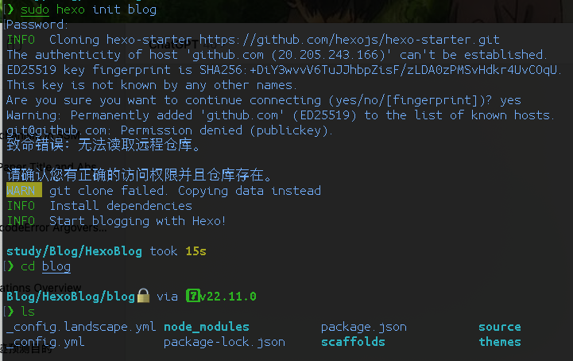

# Deploy my own blog with hexo(theme: Shoka) and github
## Prepare
- a github account
- install Git(get ssh working) and Nodejs on your PC or Mac
## Hexo
- install
`sudo npm install -g hexo-cli`
without sudo may encounter permission issues result in install fail
- init your blog folder
`hexo init blog`
`cd blog`

- install some dependencies
`sudo npm install`
`sudo npm install hexo-deployer-git --save`
- get writing root for blog file
`sudo chmod -R 777 blog`
- preview your blog
`hexo s`
visit http://localhost:4000/ you will see your blog page
- (optional) download a theme from https://hexo.io/themes/ and move the file to /blog/themes
- the Shoka theme is here https://github.com/amehime/hexo-theme-shoka
## Github pages
- create a repository namely username.github.io
- modify the deploy section in /root/_config.yml
```shell
deploy:
  type: git
  repo: https://github.com/username/username.github.io.git
  branch: main
```
- after coding your blog, you can deploy it
`hexo g`
`hexo d`
- visit http://username.github.io then you will see your blog
## Create a new blog
`hexo new "new blog name"`
put the picture in file with the same name of the new blog
## Back up the source code in another branch of the repo
refer to https://blog.51cto.com/u_14233037/5824524
- enter the .deploy_git(hidden file) folder
`cd .deploy_git`
- create a branch called src
`sudo git branch src`
- then copy the .git(also hidden) file to the blog path(parent directory)
- associate the path to the repo
`sudo git remote add origin https://github.com/username/username.github.io.git`
- run the command you will see the repo info
`sudo git remote show origin`
- 添加保存改动
```shell
sudo git add .
sudo git commit -m "source code updata"
```
- change to the src branch
`sudo git checkout src`
- pull your local source code to the repo
`sudo git push origin src:src`
- every time update following commands are needed
```shell
sudo git add .
sudo git commit -m "xxx"
sudo git checkout src
sudo git push origin src:src
```
