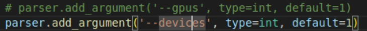
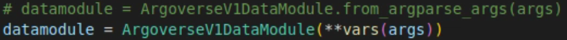
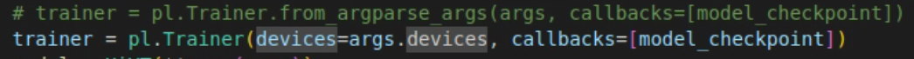
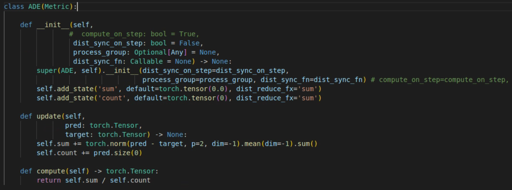
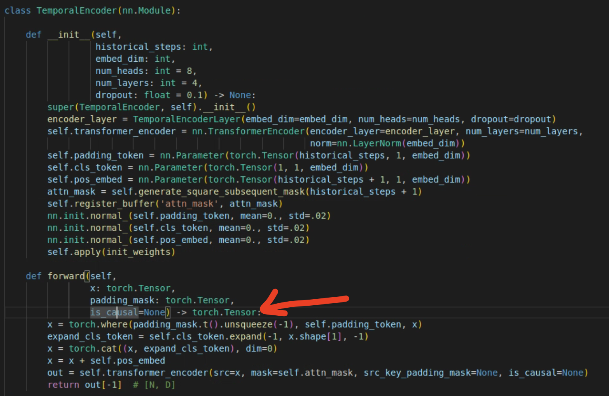
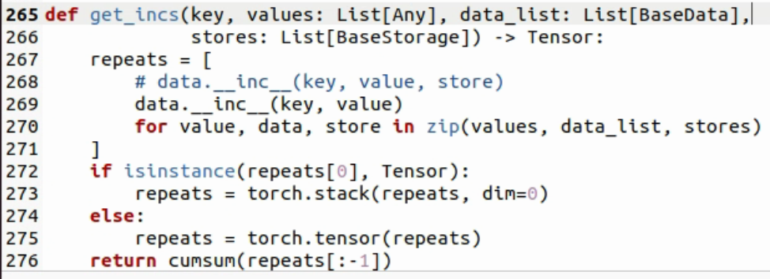

# Implement(deploy) HiVT with latest pytorch&pytorch-lightning version
- refer to https://blog.csdn.net/kddb1234/article/details/136831258, https://github.com/pyg-team/pytorch_geometric/issues/4358 and https://github.com/gzerveas/mvts_transformer/issues/68
- the official env of HiVT is pytorch 1.8, python 3.8, pytorch-geometric 1.7.2, pytorch-lightning 1.5.2 and cuda 11.1, which versions are too early. So, this blog will deploy HiVT with higher version of torch&pl with python 3.10, pytorch 2.1.0, pytorch-lightning 2.0.3, PyG 2.3.1 and cuda 12.1.
# Preparation
```
conda create -n HiVT python=3.10
conda activate HiVT
conda install pytorch==2.1.0 cudatoolkit=12.1 -c pytorch -c conda -forge
conda install pytorch-geometric==2.3.1 -c rusty1s -c conda-forge
conda install pytorch-lightning==2.0.3 -c conda-forge
```
# Modification of hivt src
## train.py
- the "gpus" in parser should be changed to "devices"

- the ArgoverseV1DataModule has no from_argoverse_args function any more, it can be input directly like:

- similarly to the pl.Trainer

## ade.py and other metrics
- the compute_on_step parameter is no need, just delete it from the input parameter of __init__ function

- same applies to other py files in the metrics directory
## local_encoder.py
the new version of nn.Transformer add a parameter is_causal so it should be added in the TemporalEncoder class, which employs nn.TransformerEncoder as transformer_encoder variable

# Modification of PyG code
find the collate.py in the directory .conda/envs/${your env name}/lib/python3.10/site-pacakages/torch_geometric/data/collate.py. Then find the get_incs function and delete the input variable 'store' of data.__inc__()
```
cd .conda/envs/${your env name}/lib/python3.10/site-pacakages/torch_geometric/data
gedit collate.py
```

# Others
If you encounter problems about variables, add '**kwargs' in forward() function may be help
# Now you can try to train HiVT follow the official doc 
- official doc: https://github.com/ZikangZhou/HiVT