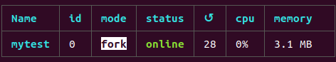
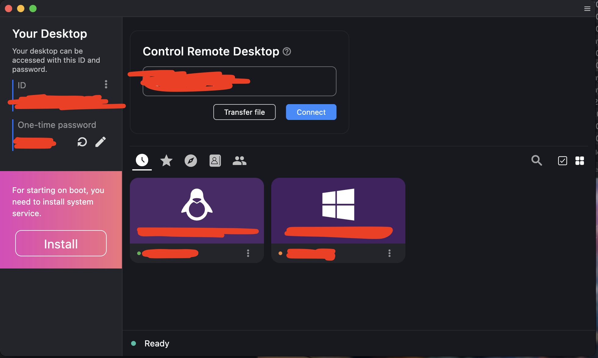

# Remote Control with rustdesk and zerotier(Macbook as control end, ubuntu as controlled end, raspberrypi4B as relay server)
## Preface
- macbook: m1 pro
- raspberry pi 4B with 4G ram and Ubuntu 20
- linux PC with ubuntu 20.04
- 课题组的服务器在1楼，工位在4楼，因此需要远程。todesk和向日葵免费版的都很糊而且todesk免费时长有限又需要经常登陆微信，不好用。
## Prepare
### Control end
- download rustdesk for mac: 官网https://rustdesk.com/，选择macos arm64下载
- download zerotier(make sure that ssh is working)
`curl -s https://install.zerotier.com | sudo bash`
### Controlled end
与控制端同理
### Relay server
- download zerotier as before
- download rustdesk-server(Note that it's not rustdesk, it's rustdesk-server, i.e. the rustdesk server) in here https://github.com/rustdesk/rustdesk-server/releases, download hbbs-arm64 and hbbr-arm64(raspberry pi is arm architecture) then unzip
- pm2 is used to manage process hbbs and hbbr, so nodejs and npm are needed
  - install nodejs
`$ sudo apt install nodejs`
  - install npm
`$ sudo apt install npm`
`$ npm install -g n`
  - install pm2
`$ npm install pm2 -g`
`$ pm2 completion install`
  - check process list
`$ pm2 ls`

- enter the  directory hbbs and hbbr and run them respectively
`$ cd /Rustdesk/rustdesk-server-hbbs_1.1.11-1_arm64/data/usr/bin`
`$ pm2 start hbbs`
`$ cd /Rustdesk/rustdesk-server-hbbr_1.1.11-1_arm64/data/usr/bin`
`$ pm2 start hbbr`
- copy the key in the file with pub suffix in the hbbs folder and it will be used later
- Open these ports on the firewall:
  - TCP(21115, 21116, 21117, 21118, 21119)
  - UDP(21116)
### Zerotier
Register a zerotier account(https://www.zerotier.com/) and create a network. Join the network in all three devices. Log in to the zerotier official website, enter the network, tick these devices, and authorize them. Get the IP address of these 3 devices
## Let's Go

In both of control end and controlled end,点击ID旁边的三个点选择Network，然后解锁，ID server和Relay server均填入relay server的内网IP，api server不填，key中填入此前保存的hbbs key。Control end中输入controlled end的ID即可连接。
<!-- ---

date: 2024-11-05 22:30:01
tags:
--- -->